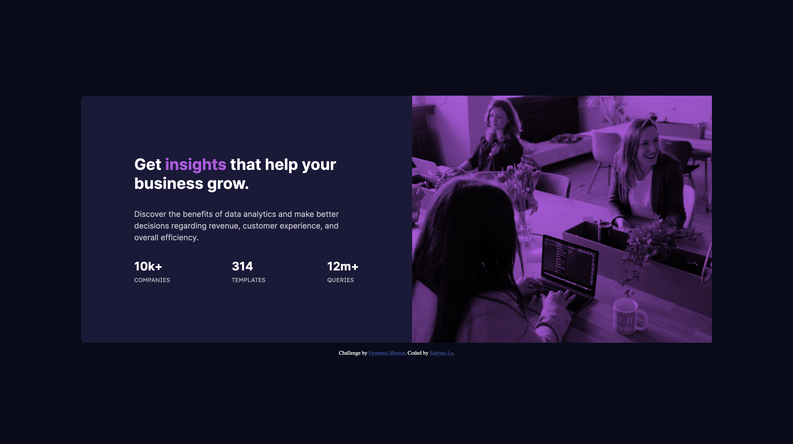

# Frontend Mentor - Stats preview card component solution

This is a solution to the [Stats preview card component challenge on Frontend Mentor](https://www.frontendmentor.io/challenges/stats-preview-card-component-8JqbgoU62). Frontend Mentor challenges help you improve your coding skills by building realistic projects.

## Table of contents

- [Overview](#overview)
  - [The challenge](#the-challenge)
  - [Screenshot](#screenshot)
  - [Links](#links)
- [My process](#my-process)
  - [Built with](#built-with)
  - [What I learned](#what-i-learned)
  - [Continued development](#continued-development)
  - [Useful resources](#useful-resources)
- [Author](#author)
- [Acknowledgments](#acknowledgments)

## Overview

### The challenge

Users should be able to:

- View the optimal layout depending on their device's screen size

### Screenshot




### Links

- Solution URL: [GitHub](https://github.com/LySabrina/Stats-Preview-Card)
- Live Site URL: [Live Site](https://lysabrina.github.io/Stats-Preview-Card/)

## My process

### Built with

- Semantic HTML5 markup
- CSS custom properties
- Flexbox
- Mobile-first workflow

### What I learned

I learned a new CSS property: text-transform and mix-blend-mode.

```css
.stat-card__stats__item > p > span {
  text-transform: uppercase;
  font-family: var(--fw-lexend);
  color: var(--c-h-white);
  display: block;
  font-size: 12px;
  font-weight: var(--fw-regular);
  margin: 0.5em;
}
.stat-card__img__header {
  width: 100%;
  height: 100%;
  mix-blend-mode: multiply;

  object-fit: contain;
  display: block;
}
```

Additionally, this time I am using rem unit for the media breakpoints instead of px.

```css
@media screen and (min-width: 50rem);
```

### Continued development

No continue development is needed. Only further continuation of flexbox is needed.

### Useful resources

- [Stackoverflow](https://stackoverflow.com/questions/66087045/picture-element-has-bigger-height-than-the-img) - Helped me understand why there is space beneath the `<picture>` element tag.

## Author

- Frontend Mentor - [@lysabrina](https://www.frontendmentor.io/profile/LySabrina)
- GitHub - [@lysabrina](https://github.com/LySabrina)

## Acknowledgments

Thanks to FrontendMentor for these projects. And me!
